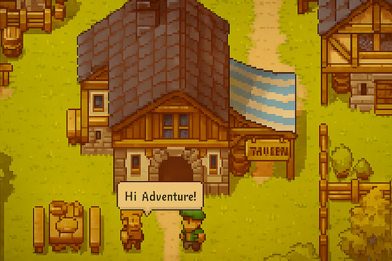

# Game Dialog Script Language

A simple language for creating game dialogs. Write dialogs as plain text with a bit of logic, and the interpreter does the rest.

The language seamlessly integrates with C# and works great in Unity and Godot with Mono. You can follow the language development progress on the [project board](https://github.com/bitpatch/game-dialog-lang/projects).



## What It Looks Like

Here's how a merchant dialog looks that greets the player differently based on reputation:

```python
reputation = 75

<< "Welcome, traveler!"

if reputation > 50
    << "Good to see you again, friend!"
    << "I have a special discount for you."
else
    << "I don't know you."
    << "Regular prices."
```

That's it! No complex configurations, JSON files, or XML markup. Just write text and add a bit of logic.

## Works with C# Out of the Box

Integrating the interpreter into your Unity or Godot project is dead simple. Here's all the code you need:

```csharp
using BitPatch.DialogLang;

var script = @"
playerName = ""Arthur""
<< ""Hello, "" + playerName + ""!""
<< ""How are you doing?""
";

var dialog = new Dialog();
foreach (var line in dialog.Execute(script))
{
    Console.WriteLine(line);
}
```

The interpreter returns strings one by one, and you simply display them on screen. No callbacks, delegates, or complex integrations. Load the script, run it, get the dialogs.

## Why It's Convenient

The entire dialog is in one file. Open it in any text editor and immediately see all the logic. Want to change a line or a condition? Just edit the text and save. No need to switch between a dialog editor, game engine, and code.

This format makes team collaboration easy. Scripts are stored in Git alongside the code, and you can see all changes in commit history. A writer can change the text, a game designer the conditions, and a programmer integrates it into the game. Everything in one place.

And one more bonus: neural networks understand this language perfectly.
